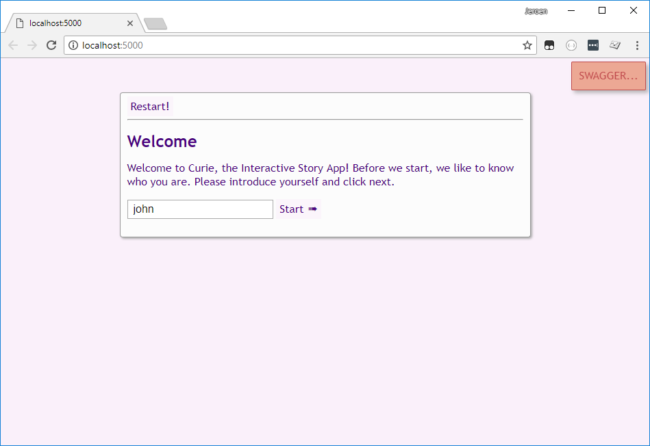

# Infi '.NET Core ❤ OSX/Linux' Dojo

Welcome to this self-paced Coding Dojo about cross-platform .NET Core development.

## About the Dojo

At Infi, a "Coding Dojo" is an event that typically holds the middle ground between:

- an instructor-led workshop
- cooperative self-study (for lack of a better term)

The material in this repository is a guide through the topic.
But _you_ are the explorer, and you are _meant_ to go off the beaten path, time permitting.

Supposing you're new to .NET and C#, expect to spend around 60 to 120 minutes for the guided part.
At the end there are several suggestions for topics to spend some extra time on.

### Target Audience

There are many good tutorials and online courses around .NET Core.
The tutorials are often of the "Getting Started" type, aimed at beginners.
Online courses are aimed at folks aiming to spend a lot of time with the platform.

This Dojo tries to be different by assuming you have _some_ experience with (web) development, in any kind of tech stack.
It should guide you along the various features of the technology stack.
The fun part will be to compare it to the tech stack(s) you might already know.
To boast how much better "your" tech stack is at something, but perhaps also to learn a few tricks from "that other" tech stack.

Depending on how skilled you are, you will have time to stray further off the beaten path.

### What this Dojo is not

The Dojo was created not by teachers or full-time course-material writers, but instead by real developers.
As such, this material:

- Is not "top-notch" course-material, but a rough guide through the topic instead;
- Is not in-depth or extensive, but focused on showing a variety of interesting parts instead;

But luckily there's plenty of those other kinds of resources around on the internet.

Also important to note: this codebase is _not_ exemplary for production applications.
We normally value things like sensible test coverage, domain-driven design, CQRS, the SOLID principles, while avoiding things like over-engineering and "not-invented-here syndrome".
This codebase willingly violates several of those best practices, so that we can focus on guiding you along the platform features.

### About the Code

This codebase is structured as follows:

- The `master` branch, containing merely the basics for the repo, including **the guide** (but not any code).
- The `solution` branch, containing **all the spoilers!**: the finished codebase (your code should resemble this at the end of the guide).
- A set of `step-##-start` tags, pointing to commits that show the codebase at the _start_ of a step.

Cloning the repository will be part of one of the early steps.
Note that the code in this repo is [MIT licensed](LICENSE.txt), and that we welcome improvements and fixes!

### Prerequisites

We assume that you have an operating system that supports .NET Core 2.x (tested with 2.0).
Windows, macOS, and most mainstream Linux flavors are all supported.
[**The first thing you need is to download the .NET Core SDK**](https://www.microsoft.com/net/download/).

**The second thing you need is an editor.**

Although technically you can use Vim or Notepad or whatever to write code, we recommend using an IDE.
Some of us love and use [Jetbrains Rider](https://www.jetbrains.com/rider/), and we certainly recommend trying it.
It works on all platforms, but has a price tag (there's a trial available though).

Another great (though more minimal and slightly tougher) option is [VS Code](https://code.visualstudio.com/).
It's gratis, cross-platform, and lightweight.

Finally, you could use [Visual Studio 2017](https://www.visualstudio.com/vs/community/).
On Windows, that's definitely a great option still, and the Community Edition is gratis and works just fine.
It's a pretty hefty download though.

PS. Note that the "Visual Studio for Mac" IDE is ultimately a clone of Xamarin Studio (as opposed to a port of VS itself).
Although it should theoretically work, it's untested.

## The Guide

### Step 00 - Exploring the dotnet CLI

Before, there was ".NET", a.k.a. "The 'Full' .NET Framework".
This was a Windows-only runtime for .NET applications.
There was also an API-compatible clone called Mono allowing you to build the same code to make it run on other platforms (Linux, or iOS/Android via Xamarin).

Now there are _two_ new things:

- **.NET Standard (2.x currently)**: an "API specification" for .NET runtimes, similar to the Android API "Level";
- **.NET Core (2.x currently)**: an implementation of .NET Standard, available builds cross-platform, and sources available under the MIT license;

To _create_ .NET Core applications, you need to download the SDK.
Check the Prerequisites above for instructions, you should be able to run this from your favorite terminal:

```bash
dotnet --version
# Example output: 2.1.200

dotnet --help
# Shows CLI commands
```

Confirm this is working properly before continuing.

Before we move to the code from this guide, let's first try our setup.
Create a clean, empty folder, go there with your terminal, and execute:

```bash
dotnet new --help
```

This shows a lot of stuff, and at the bottom it shows all the pre-installed project templates.
Let's skip the boring old Console Application, and dive straight into things:

```bash
# Execute in your fresh "test" folder:
dotnet new webapi
```

Follow this by:

```bash
dotnet run
# Outputs "Now listening on: http://localhost:5000" or similar
```

The root of that address will be empty.
But on [http://localhost:5000/api/values](http://localhost:5000/api/values) you will find that the API responds to your `GET` just fine.

Congratulations, you're now a .NET Developer!

In fact, you're an _ASP.NET Core_ developer.
ASP.NET Core is the cross-platform web application framework that runs on top of .NET Core.
You can create server-side websites with client-side components with it (ASP.NET Core "MVC").
In this Dojo however, we will focus on ASP.NET Core "Web API" instead, and use a simple handcrafted SPA to talk to it.

**Recommended bonus**: if things are going smooth, we recommend spending about 5 minutes to explore the created project in your IDE.
For example, open the `test.csproj` file in Jetbrains or Visual Studio, or the project folder in VSCode.
See what the CLI generated for you.

> ⚠ Don't forget to stop the `dotnet run` server, or else port `:5000` will be taken and break the next steps!

### Step 01 - Running the Dojo Code

We're ready to dive in. Start with these steps:

1. Clone this repository (or your own fork, if you like);
1. Check out the `step-01-start` tag;

From here on out there are two ways to follow the Dojo.
You can mix and match approaches, which you take is a matter of preference.
You can either:

1. Do work on detached heads (the tag commit), discard after each step, and start the next step fresh from the repo's code.
1. Start with `git checkout -b my-dojo-attempt` or some such, and commit your own results as you go.

In any case, now that you're set up, open up the `InfiCoreDojo.sln` (VS2017, Jetbrains), or the root folder itself (VSCode).
Note that you might need to mark the `InfiCoreDojo.Api` as the Startup Project in your IDE.
Try to "Build" the solution, and then "Debug" or "Start with Debugger" option.
Typically this is either the F5 key or some main menu option.

Open `http://localhost:5000` if it hasn't opened automatically, and you should see the application's welcome screen.
It's a light-purple site with "WELCOME" in big friendly letters.
Like this:



Congratulations, you're up and running!

**Recommended bonus**: check out the application's current state, click through the GUI, check out the app.
Also, check out **the "SWAGGER" button top left** and give the API endpoints a go.
Finally, find `PlayerController.cs` and place a debugger breakpoint at the first line of the `Choose(...)` method.
Click a bit in the App and see that your IDE hits the break point.

### Step 02 - Codebase Layout

The starting point for this step is the same as for step 1.
If you want to be completely fresh, reset your working copy and check out `step-02-start`.

Let's investigate the codebase layout a bit.
Here's the basic structure of our application:

- The `InfiCoreDojo.Api` project contains the main project, and is also the "composition root". It contains:
  - `Program.cs` for running/hosting the application (the ".NET Core" part)
  - `Startup.cs` for bootstrapping the API bits (the "ASP.NET Core" part)
  - Several `Controllers` corresponding to API endpoints
  - A `wwwroot` containing the SPA as part of the API project (this could've also been hosted separately, but then we'd have CORS stuff to handle)
- The `InfiCoreDojo.Api.Tests` project. Typically each .NET project has a sibling `.Tests` project for unit and/or integration tests.
- The `InfiCoreDojo.DataAccess` project. For demo purposes we'll have different data stores in one project.
- The `InfiCoreDojo.Domain` project with "entities".

The architecture of this application isn't great.
But remember: the point is to go on a Tour, not to design the perfect N-Tier Microservices Containerized Strangler Application Monolyth™.
It showcases how you can have multiple projects that reference eachother.

Now, to your exercise, for this step, try to:

- Use your IDE's filter features to find all classes with "Player" in them;
- Start by navigating to the `PlayerController` class, find the _current_ controller
- Use your IDE's "go to definition" feature to drill down to the `IPlayerDal` interface
- Use your IDE's "find implementations" feature to navigate to the (only current) implementation of that interface
- Investigate that Player DAL, drill down to the `Player` class and check that one out too

This step is complete when you've got a feeling you're comfortable navigating the solution.
Being able to find stuff will be instrumental for the next steps.

Congratulations, you're now an _expert_ with your IDE!

**Recommended bonus**: if you have some spare time (because you are _that_ awesome!) then consider investigating the `wwwroot` contents, skimming through the JavaScript a bit.
In addition, you could check out the properties of projects, most notably the API project.

### Step 03 - Managing NuGet Packages

For the last time, we remain at the same starting point.
For a fresh status, reset your working copy and check out `step-03-start`.

Let's talk about .NET's package manager: NuGet.
Should you measure package managers in "How Much Pain They Cause", this one's at least a lot better than NPM :-D.
Nah, just kidding, we love NPM too.

Under the hood, NuGet is basically a CLI tool.
However, the `dotnet` CLI as well as the IDEs we use in this Dojo all wrap NuGet in one way or another.
Each IDE does so slightly differently, but they should all be fairly self-explanatory in function.

We will be **adding packages to the `InfiCoreDojo.Api` project**, let's start with something simple:

- [Serilog.AspNetCore](https://www.nuget.org/packages/Serilog.AspNetCore)
- [Serilog.Sinks.Console](https://www.nuget.org/packages/Serilog.Sinks.Console)

Look for your IDE's way to manage NuGet packages and add those two to the Api project.
These packages allow us to do structured logging.
Each "Destination" a.k.a. "Sink" has its own package.
For production we could add all sorts of Sinks (files, Elastic, online services, etc), but we'll keep it simple for now.

Follow [the base Serilog instructions](https://github.com/serilog/serilog-aspnetcore#instructions) to change `Program.cs` (just the first two code blocks).
Optionally remove the logging settings from `appsettings.json`.

Before we can test this we need to add some logging.
We'll use the global static logger for now, like this:

```csharp
Log.Logger.Information("My string with {PlaceHolders} in it", SomePlaceholderValue);
```

Let's add this to the `PlayerController`:

1. Log info: `"Asking for player {Name}"` in `Get(...)`
1. Log info: `"Retrieving current level for player {Name}"` in `GetCurrentLevel(...)`
1. Log info: `"Making player choice {@Choice}"` in `Choose(...)` (the `@` symbol logs the variable as inline json, basically you tell Serilog it's a Plain-Old-Csharp-Object, Poco)
1. Log a warning: `"Executing reset command {@Reset}"` in `Restart(...)` even though it's still empty

Now run the application again, and verify that API calls are being written to your console.
You might need to look around in your IDE for an "Output" window, possibly with an ASP.NET Web sub-window or dropdown.
This might be a bit tough to find, Google and Dojo-colleagues are your friends!

Congratulations, you've edited some code!

**Recommended bonus**: check out the diff for your code, specifically the `.csproj` file changes.
Try to add [Serilog.Sinks.File](https://github.com/serilog/serilog-sinks-file) but by manually editing that `.csproj` file.
Change your `Program.cs` in a way that both the `File` and `Console` sink are in use.

### Step 04 - Changing the Controller

This time we start from tag `step-04-start` (or wherever you left off last step).

In this step you'll:

1. Implement the `Restart(...)` method on `PlayerController`
1. Connect the `dal.js` front-end method corresponding to the restart endpoint
1. Verify that things are working by running and testing the application

For this step, we'll just leave you to it!
There are no further instructions for this step.
Don't worry though if you still don't know what to do.
Either ask for help, or have a peek at the diff between `step-04-start` and `step-05-start` to see how we did this step.

**Recommended bonus**: Write a test or two for the logic you wrote in `Restart(...)`.
Note that there are already some tests for the `PlayerController`.
PS. This touches on some pretty tough and ugly Mocking issues, so feel free to skip this bonus objective.

### Step 05 - Dependency Injection

Start this step from tag `step-05-start` or where you left off with step 4.

ASP.NET Core has - for better or for worse - embraced Dependency Injection (DI) to a point where it's a built in part of the framework.
Although there's still a case to be made for specific Dependency Injection tools ("containers"), in this Dojo we will stick to the built in features.

There's no room or time here for an extended explanation (Google's your friend! We are also your friend!), so we'll stick to a short version here.
Note that it's slightly opinionated, and moderately .NET Core specific.

Basically you want your classes to ask for all the types it depends on to function correctly.
So as a rule of thumb, these are a 'forbidden':

- Using `new` to create instances of complex (services and such) and/or foreign (i.e. from other namespaces/projects) types
- Using globally available objects (i.e. `static` types)

Instead, your classes should ask for these "dependencies" in the constructor.
Preferably you ask for them via an abstraction, typically an `interface`.
The DI framework ("Container") will then provide specific implementations as it well pleases.
For one, this allows you to swap out one implementation for the other, without changing the dependent class.

Okay, enough theory.
Let's have some action!

Currently, we have violated the above rule of thumb.
Both controllers use `new` to create foreign types: their DataAccess Layer dependencies.
Let's fix this, starting with the `LevelController`.

Remove the `= null` default for the constructor argument. The DI framework will now _always_ have to supply something.
Instead of `new`ing an `InMemoryLevelDal` in the constructor, throw an exception:

```csharp
public LevelController(ILevelDal levelDal)
{
    this.levelDal = levelDal ?? throw new ArgumentNullException(nameof(levelDal));
}
```

Repeat the same changes for the `PlayerController`.
Then fire up the application and try to do stuff.
You should see Serilog output something along these lines:

> System.InvalidOperationException: Unable to resolve service for type 'InfiCoreDojo.DataAccess.IPlayerDal' while attempting to activate 'InfiCoreDojo.Api.Controllers.PlayerController'.

In short: the DI framework doesn't know how to provide an `IPlayerDal`.
Makes sense, because we haven't told it how to do so.
Let's fix this!
Open up `Startup.cs` and at the bottom of `ConfigureServices(...)` add:

```csharp
services.AddScoped<ILevelDal, InMemoryLevelDal>();
services.AddScoped<IPlayerDal, InMemoryPlayerDal>();
```

This tells the DI framework to supply an `InMemory...Dal` whenever some class constructor asks for the interface type.
Fire up the application again and verify that things are working again.

Congratulations, you're now using Dependency Injection!

**Recommended bonus**: the `InMemoryDatabase` can be registered with `services.AddSingleton...` with the dependency injection container.
The `...Dal` classes can then ask for it in the constructor.
Surely you have enough info now to do this task?

### Step 06 - Unit Tests

Start this step from tag `step-06-start` or where you left off with step 5.

There are some unit tests in the current codebase already.
Some were there from the start, some you might've created for the bonus of previous steps.
Either way, try to find your IDE's Test Runner, and see if you can run the current set of tests.
All of them are located in `InfiCoreDojo.Api.Tests`.
Methods marked with a `[Fact]` attribute are xUnit tests.

If you have trouble running the tests, please look for help to get things up and running.
You'll need it for the rest of this step.

Next up we'll add a new project `InfiCoreDojo.Domain.Tests`.
Try to make it a "Class Library (.NET Standard)" project (the "xUnit Test Project" is also an option, but skips the interesting bits we want to do manually this time).
You have several ways to do this, pick your favorite:

- Your IDE will likely have an Add "New Project.." option
- The CLI has a [`dotnet new ...`](https://docs.microsoft.com/en-us/dotnet/core/tools/dotnet-new?tabs=netcore2x) option for new projects
- Copy the `InfiCoreDojo.Api.Tests` project files and edit them manually

After doing this, try to recall the step about NuGet.
You will need these for your new project:

- [xunit](https://www.nuget.org/packages/xUnit)
- [xunit.runner.visualstudio](https://www.nuget.org/packages/xUnit.Runner.VisualStudio)

Create a class (or rename `Class1` if it was generated) called `PlayerTests`.
Add this to your class:

```csharp
[Fact]
public void Tests_are_working()
{
    Assert.True(9001 > 42);
}
```

And run the tests in your IDE to see this one light up green!

Next up, find the "Dependencies" section in your project.
In VSCode this might mean editing the `.csproj` file directly.
Create a reference to the `InfiCoreDojo.Domain` project.
This is required for the _test_ project to use types from the actual `Domain` project.

Now find `Player.cs` and its `MoveTo(...)` method.
We would like to improve that method, by `throw`ing an `InvalidOperationException` if a player tries to move to the level they're currently in.
Try to do some proper TDD if you still have the energy.

1. Write a `[Fact]` in the new project to `Assert.Throws<InvalidOperationException>(...)`.
1. Run the test and see that it's red.
1. Fix the `MoveTo(...)` method to make it green.
1. ...
1. Profit!

Congratulations, you are now a _project manager_!

**Recommended bonus**: see if you can use the `dotnet` CLI to run the tests too.
This will come in handy if you want to run builds on a CI server...

### Step 07 - Wrapping Up

Start this step from tag `step-07-start` or where you left off with step 6.

In this final step we'll put some things from previous steps together.
We will add our own, _naive_ file-based mini-json-database to the DataAccess project.
By now you should be pretty familiar with everything, so we're going to lay things out only in basic steps:

1. Grab the `levels.json` and `players.json` files from the `/sample-data` folder from the root in the `master` branch
1. Place them in the `DataAccess` folder in a subfolder called `Data` and **set them as "Embedded Resource"** (Google and _we_ are your friends!)
1. Add the `Newtonsoft.Json` NuGet package to `DataAccess`
1. Next add a `public class JsonFileLevelDal : ILevelDal { ... }` to `DataAccess`.

Here's a skeleton for that class, you just have to implement the interface methods.
Check the `InMemory...Dal` classes for examples, but don't forget to add `Save()` calls where needed.

```csharp
public class JsonFileLevelDal : ILevelDal
{
    private readonly string _fileName;
    private readonly string _filePath;
    private readonly List<Level> _data;

    public JsonFileLevelDal()
    {
        _fileName = "levels.json";
        _filePath = Path.Combine(Path.GetTempPath(), _fileName);

        if (!File.Exists(_filePath))
        {
            SeedDatabaseFilesFromEmbeddedResources();
        }

        var json = File.ReadAllText(_filePath);
        _data = JsonConvert.DeserializeObject<List<Level>>(json) ?? new List<Level>();
    }

    // TODO: Implement ILevelDal members

    private void Save()
    {
        var json = JsonConvert.SerializeObject(_data);
        File.WriteAllText(_filePath, json);
    }

    protected void SeedDatabaseFilesFromEmbeddedResources()
    {
        var assembly = this.GetType().Assembly;
        var resourceName = "InfiCoreDojo.DataAccess.Data." + _fileName;

        using (var stream = assembly.GetManifestResourceStream(resourceName))
        using (var reader = new StreamReader(stream))
        {
            var json = reader.ReadToEnd();
            File.WriteAllText(_filePath, json);
        }
    }
}
```

Repeat the same process for a `public class JsonFilePlayerDal : IPlayerDal { ... }`.

The only final thing to do here is to swap out implementations.
Change the `Startup.cs` class and replace the `AddScoped<...>()` calls with these:

```csharp
services.AddScoped<ILevelDal, JsonFileLevelDal>();
services.AddScoped<IPlayerDal, JsonFilePlayerDal>();
```

Now the DI container will supply different implementations for those interface, without needing to change the controllers.
Sweet!

Run your application, and **be sure to check ❤ the awesome story ❤ we've provided in those json files!**

Congratulations, you now have a fully functional game!

**Recommended bonus**: use inheritance and generics to DRY up the two new Dal classes.

**Recommended bonus**: use a `Configuration.GetValue<bool>("UseInMemoryData")` call in an `if` statement to make the `Startup.cs` registrations conditional.
The `UseInMemoryData` boolean can be saved in the `appsettings.json` file.

> 🛈 If you want to see what _we_ made of things up until the end, you can do `git checkout ...` on the solution branch.

## Exercises for the Reader

So, you've come this far, and you want more?
Here's a recommended set of things to follow up with.

- [EF Core on ASP.NET Core](https://docs.microsoft.com/en-us/ef/core/get-started/aspnetcore/) is about using Microsoft's ORM "Entity Framework" to access your RDBMs (tip: consider using the [mssql-server-linux](https://hub.docker.com/r/microsoft/mssql-server-linux/) Docker images);
- [ASP.NET Core MVC](https://docs.microsoft.com/en-us/aspnet/core/tutorials/first-mvc-app/) rush through the tutorial to create an MVC application;
- [Dockerization](https://docs.microsoft.com/en-us/dotnet/core/docker/intro-net-docker) running .NET Core applications in Docker containers;
- [C# Language Tour](https://docs.microsoft.com/en-us/dotnet/csharp/tour-of-csharp/index) if you want to see a bit more about the main .NET language;
- [SignalR](https://docs.microsoft.com/en-us/aspnet/core/signalr/get-started) for WebSockets communication between a browser client and ASP.NET Core application;
- [Hosting and Deployment](https://docs.microsoft.com/en-us/aspnet/core/host-and-deploy) for trying out hosting options for ASP.NET Core;
- **Console Application**: try to create a console application that reads from stdin and writes to a file, and run it on your own OS as well as another (e.g. in a VM or interactive container)

Perhaps all those options seem boring.
Or you've already done all of them!?
That probably means it's time to start building your first actual application with .NET.
Or send some mean tweets or write an angry blog post about how stupid .NET Core is.
All good to us, we just hope you learned a thing or two today ❤

## License

This code is provided under the [MIT license](LICENSE.txt).
